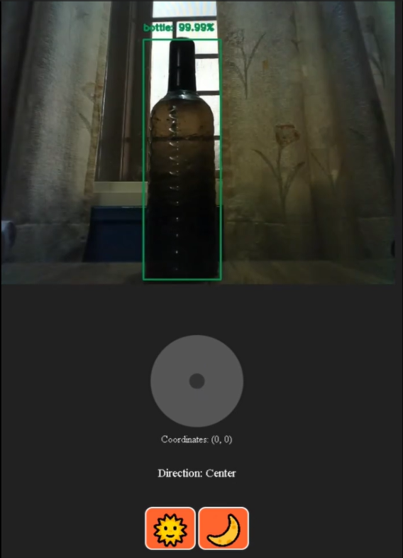

# SurveillanceBot Mk3

## Overview

**SurveillanceBot Mk3** is a state-of-the-art robotic surveillance platform that integrates live video streaming, object detection, GPS tracking, and environmental sensing. Built with **ESP32 microcontrollers** and **FreeRTOS**, it enables multitasking and efficient resource management, making it a versatile tool for surveillance and monitoring applications.

---

## Evolution of the Project

### **Mk1: Initial Prototype**
The first iteration of SurveillanceBot featured:
- **GPS Tracking**: Integrated NEO-6M for real-time location tracking.
- **Environmental Sensing**: Equipped with MQ-2 gas and HX710B pressure sensors.
- **Live Video Streaming**: ESP32-CAM for real-time camera feeds.
- **Remote Control**: Controlled via a web-based interface.

While comprehensive, Mk1's performance was limited by the computational load of running all features simultaneously.

[](https://youtu.be/WJb3seyeVC8?si=DuR95ykVmRgoRFpG)  
*Click to watch the Mk1 demo.*

---

### **Mk2: Streamlined Performance**
To improve performance, Mk2:
- Removed **GPS Tracking** and **Environmental Sensing** to reduce computational strain.
- Focused solely on **Live Video Streaming** and **Object Detection** using the MobileNet SSD model.
- Optimized the hardware and software for smoother operation.

This iteration achieved significant improvements in stability and responsiveness.

[](https://youtube.com/shorts/mzBQwa8xZ_E?si=kc09f3fxIJcmkMoF)  
*Click to watch the Mk2 demo.*

---

### **Mk3: Comprehensive Surveillance**
Mk3 reintroduced features from Mk1, addressing earlier computational limitations by incorporating **FreeRTOS** for multitasking. Key enhancements include:
- **Reintegration of GPS Tracking and Environmental Sensing**.
- **FreeRTOS Multitasking**: Efficient task scheduling for live video, object detection, GPS, and sensors.
- **Improved Web Interface**: Unified control dashboard for all functionalities.

This iteration represents the culmination of the project's evolution, balancing performance and functionality.

---

## Features

1. **Live Video Streaming and Object Detection**:
   - Real-time streaming using ESP32-CAM.
   - Object detection powered by MobileNet SSD and OpenCV.

2. **GPS Tracking**:
   - Tracks real-time geographic location with the NEO-6M GPS module.
   - Displays location on a web-based dashboard.

3. **Environmental Sensing**:
   - Detects gas concentrations with the MQ-2 sensor.
   - Measures atmospheric pressure using the HX710B sensor.

4. **Multitasking**:
   - Manages video, GPS, and sensor monitoring simultaneously using FreeRTOS.

5. **Remote Control**:
   - Navigate the robot via a web-based interface.
   - Adjust mounted components using a servo motor.

---

## Hardware Components

| Component              | Purpose                                            |
|------------------------|----------------------------------------------------|
| **ESP32-CAM**          | Captures live video and performs object detection. |
| **ESP32 DEVKIT**       | Handles GPS tracking and sensor data monitoring.   |
| **NEO-6M GPS Module**  | Tracks real-time geographic location.              |
| **MQ-2 Gas Sensor**    | Detects gas concentrations in the environment.     |
| **HX710B Pressure Sensor** | Measures atmospheric pressure.                 |
| **L298N Motor Driver** | Controls the movement of dual-shaft BO motors.     |
| **Dual Shaft BO Motors** | Provides mobility for the bot.                   |
| **Servo Motor**        | Adjusts mounted components remotely.               |
| **Battery Pack**       | Powers the robot's components.                     |

---

## Software Requirements

### 1. Arduino IDE
- Install libraries:
  - `esp_camera`
  - `WiFi`
  - `TinyGPSPlus`
  - `HX710B`
  - `Servo`

### 2. Python
- Install dependencies:
  ```bash
  pip install opencv-python imutils requests flask
  ```

### 3. FreeRTOS
- Utilized for efficient multitasking on ESP32.

---

## Circuit Diagrams

### **Car Control Circuit**
<div align="center">
    
</div>

---

### **Tracker Circuit (GPS and Sensor Module)**
<div align="center">
    
</div>

---

## Installation

### 1. Clone the Repository
```bash
git clone https://github.com/Jjateen/SurveillanceBotMk3.git
```

### 2. Configure Arduino Sketches
1. Open `arduinoSketch/arduinoSketch.ino` in Arduino IDE.
2. Set your Wi-Fi credentials in the sketch.
3. Upload the sketch to the ESP32-CAM and ESP32 DEVKIT boards.

### 3. Run the Python Server
Launch the Flask web server:
```bash
python app.py
```

---

## Usage

### 1. Power On the Bot
- Connect ESP32 modules to the battery pack.

### 2. Access Web Interfaces
- Use the IP addresses displayed in the serial monitor to access:
  - Live video streaming and robot control.
  - GPS location and environmental sensor data.

### 3. Control the Bot
- Use the web interface to:
  - Move the robot forward, backward, left, and right.
  - Monitor real-time video, GPS location, and sensor readings.

---

## Detailed Working

### **Multitasking with FreeRTOS**
- **Task 1**: Web server for live video streaming and object detection.
- **Task 2**: Web server for GPS tracking and environmental monitoring.

### **Object Detection**
- Utilizes MobileNet SSD for identifying objects in the live video stream.
- Processes frames directly on the ESP32-CAM.

### **GPS and Sensor Monitoring**
- Displays real-time GPS coordinates and sensor data on a Flask dashboard.

---

## Output and Interface Views

### **Controller Interface**
<div align="center">
    
</div>

---

### **Sat View Interface**
<div align="center">
    
</div>

---

### **Flowchart**
<div align="center">
    
</div>

---

## License
This project is licensed under the **Apache 2.0 License**.

---

## References
- [SurveillanceBot Mk1 Repository](https://github.com/Jjateen/SurveillanceBot)
- [SurveillanceBot Mk2 Repository](https://github.com/Jjateen/SurveillanceBotMk2)
- [FreeRTOS Documentation](https://www.freertos.org/)
- [TinyGPSPlus Library](https://github.com/mikalhart/TinyGPSPlus) 

--- 
