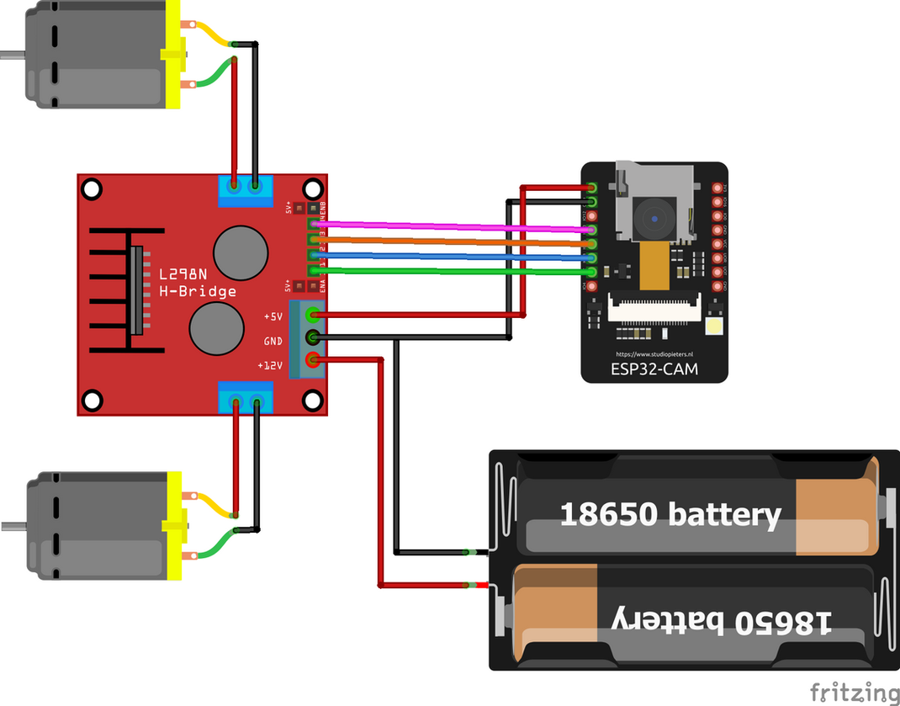
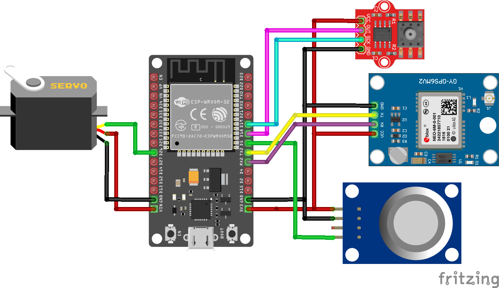
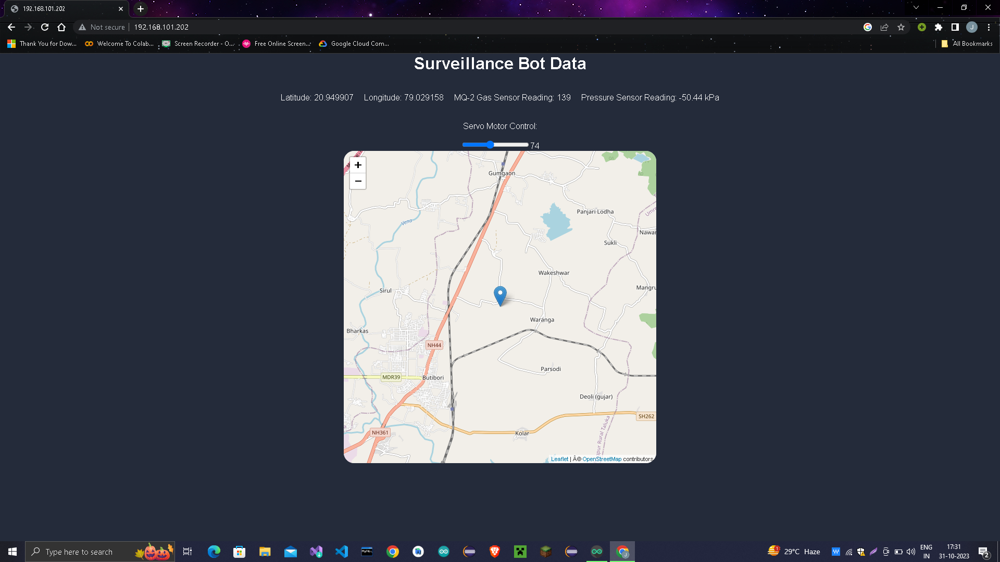
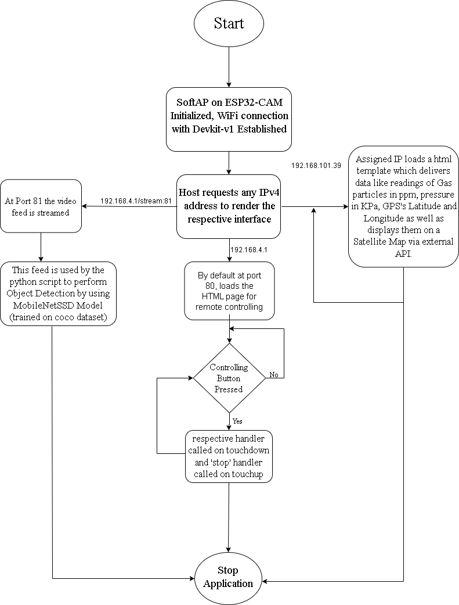

# SurveillanceBot

<p align="center"> <br> <b>Indian Institute of Information Technology, Nagpur</b><br><br> <b>Project Report on</b><br> <b>Surveillance Bot</b><br><br> <b>Submitted by:</b><br> LostAndFound io<br><br> <b>Group Members:</b><br> 1. <a href="https://github.com/Jjateen">Jjateen Gundesha BT22ECI002</a><br> 2. <a href="https://github.com/afloatwont">Ayush Ambatkar BT22ECI005</a><br> 3. Darshan Tate BT22ECI011<br><br> <i>A report submitted for the partial fulfilment of the requirements of the course</i><br> <b>ECE-206 Sensors and Transducers</b><br><br> <i>Submission Date: 31/10/2023</i><br> <b>Mini Project</b><br><br> <i>Under the guidance of:</i><br> <b>Dr. Mayank Thacker</b><br> Department of Electronics and Communication Engineering </p>

## Table of Contents
1. [Introduction](#introduction)
2. [Features](#features)
3. [Hardware Components](#hardware-components)
4. [Software Requirements](#software-requirements)
5. [Circuit Diagrams](#circuit-diagrams)
6. [Project Structure](#project-structure)
7. [Installation](#installation)
8. [Usage](#usage)
9. [Detailed Working](#detailed-working)
10. [Output and Interface Views](#output-and-interface-views)
11. [Flowchart](#flowchart)
12. [License](#license)
13. [References](#references)

---

## Introduction
The **SurveillanceBot** project demonstrates the development of an autonomous surveillance system using an ESP32 microcontroller. This mobile robot is equipped with a camera module for live video streaming, a GPS module for location tracking, and an MQ-2 gas sensor for environmental monitoring. The bot's design allows it to be controlled via a user-friendly web interface and enhances its functionality with real-time object detection powered by OpenCV.

Robotic systems have seen diverse applications, from security and environmental monitoring to industrial automation. This project integrates multiple sensors and actuators, showcasing the capabilities of the ESP32 platform in real-world scenarios.

### Objectives
1. **Navigation and Positioning**: Use the NEO-6M GPS module for real-time position tracking.
2. **Gas Detection**: Detect environmental gases using the MQ-2 sensor.
3. **Remote Control**: Facilitate bot movement control through a web interface.
4. **Data Visualization**: Present sensor data in an organized manner on a web dashboard.
5. **Safety**: Ensure reliable operation, especially for hazardous gas monitoring.

---

## Features
- **Remote Control**: Move the bot in real-time via a web interface.
- **Live Video Stream**: View a live feed from the ESP32-CAM.
- **Object Detection**: Identify objects using OpenCV and respond accordingly.
- **GPS Tracking**: Pinpoint the bot's location on a map.
- **Environmental Monitoring**: Measure gas concentration and pressure.
- **Servo Motor Control**: Adjust the angle of a servo motor from the web interface.

---

## Hardware Components
1. **ESP32-CAM**: Handles video streaming and connects to the Wi-Fi network.
2. **NEO-6M GPS Module**: Provides real-time geographic coordinates.
3. **MQ-2 Gas Sensor**: Detects gas concentrations in the environment.
4. **HX710B Pressure Sensor**: Measures atmospheric pressure.
5. **L298N Motor Driver**: Controls the robot's motors for movement.
6. **Dual Shaft BO Motors**: Drive the robot's wheels.
7. **Servo Motor**: Controls the angle of mounted components or sensors.
8. **Battery Pack**: Powers the bot for autonomous operation.

---

## Software Requirements
- **Arduino IDE**: To program the ESP32 and ESP32-CAM boards.
- **Python**: For running the object detection script.
- **Libraries**:
  - Arduino: `esp_camera`, `WiFi`, `TinyGPSPlus`, `HX710B`, `Servo`
  - Python: `cv2` (OpenCV), `imutils`, `requests`

---

## Circuit Diagrams
### Car Control Circuit


### Tracker Circuit (GPS and Sensor Module)


---

## Project Structure
```
SurveillanceBot/
│
├── ESP32CAM_Car/
│   ├── ESP32CAM_Car.ino         # ESP32-CAM control code
│   ├── app_httpd.cpp            # HTTP server code for video streaming
│   └── camera_index.h           # Camera configurations
│
├── gpsNpressureNMQ/
│   └── gpsNpressureNMQ.ino      # Code for GPS, MQ-2, and HX710B sensors
│
├── ObjectDetectionFrames/        # Sample images for testing
│   ├── Screenshot_60.png
│   ├── Screenshot_66.png
│   └── Screenshot_68.png
│
├── main.py                      # Object detection script using OpenCV
├── MobileNetSSD_deploy.caffemodel
├── MobileNetSSD_deploy.prototxt.txt
├── car_ckt.png                  # Car control circuit diagram
├── tracker_ckt.png              # Tracker circuit diagram
├── sat_view.png                 # Satellite view frontend
├── Controller.jpeg              # Bot control interface
├── LICENSE                      # License information
└── README.md                    # This README file
```

---

## Installation
1. **Clone the Repository**:
   ```bash
   git clone https://github.com/Jjateen/SurveillanceBot.git
   ```
2. **Configure Arduino IDE**:
   - Install ESP32 Board Support.
   - Load and configure `ESP32CAM_Car.ino` and `gpsNpressureNMQ.ino` sketches.
   - Set your Wi-Fi credentials in both sketches.
3. **Install Python Dependencies**:
   ```bash
   pip install opencv-python imutils requests
   ```
4. **Upload the Sketches**:
   - Upload `ESP32CAM_Car.ino` to the ESP32-CAM board.
   - Upload `gpsNpressureNMQ.ino` to the ESP32 DEVKIT board.

---

## Usage
1. **Power the Bot**: Connect the power supply to the ESP32-CAM and ESP32 DEVKIT.
2. **Connect to the Web Interface**: Open a browser and enter the IP address shown in the serial monitor.
3. **Control the Bot**:
   - Use directional buttons to move the bot.
   - View the live video feed.
   - Monitor GPS and sensor data on the dashboard.
   - Adjust the servo motor using the slider.

---

## Detailed Working
### ESP32-CAM Module
1. **Initialization**: Powers up and configures the camera and Wi-Fi.
2. **Web Server**: Hosts a live streaming interface for remote control.
3. **Object Detection**: Processes frames using OpenCV and identifies objects.

### ESP32 DEVKIT Module
1. **GPS Module**: Uses TinyGPSPlus to parse and display coordinates.
2. **Gas Sensor**: Reads analog values and displays them on the interface.
3. **Pressure Sensor**: Uses HX710B to measure pressure and sends data to the interface.
4. **Servo Control**: Adjusts servo position based on user input.
---
## Output and Interface Views

### Controller Interface
<div align="center">
    
</div>

### Satellite View (GPS Tracking)
<div align="center">
    
</div>

### Example Object Detection Frame
<div align="center">
    
</div>

---

## Flowchart
<div align="center">
    
</div>

---

## License
This project is licensed under the [MIT License](./LICENSE).

---

## References
1. [TinyGPSPlus Library](https://tinyurl.com/efnfrwm4)
2. [ESP32-CAM Object Detection](https://how2electronics.com/esp32-cam-based-object-detection-identification-with-opencv/)
3. [ESP32 GPS Integration](https://esp32.com/viewtopic.php?t=7294)

---
